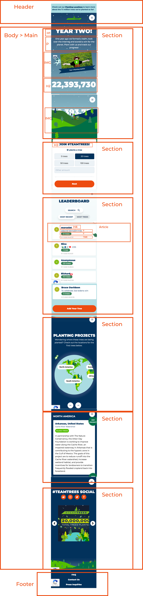
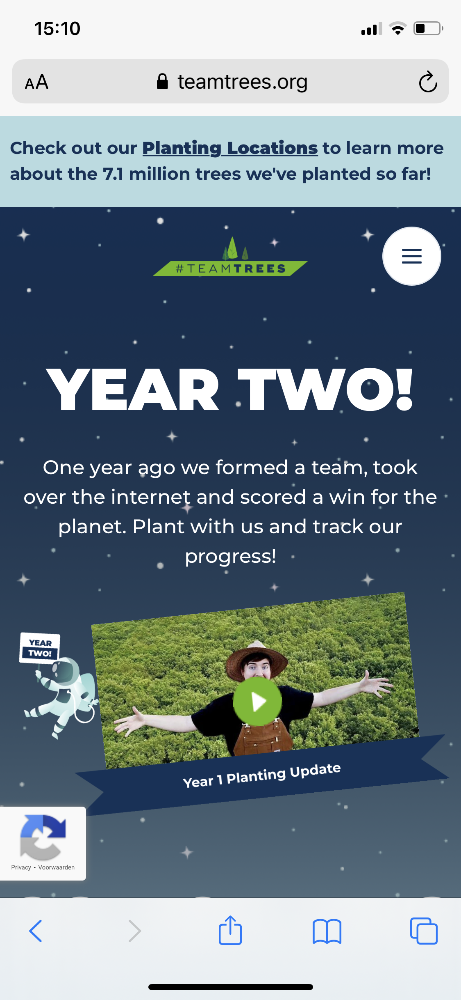
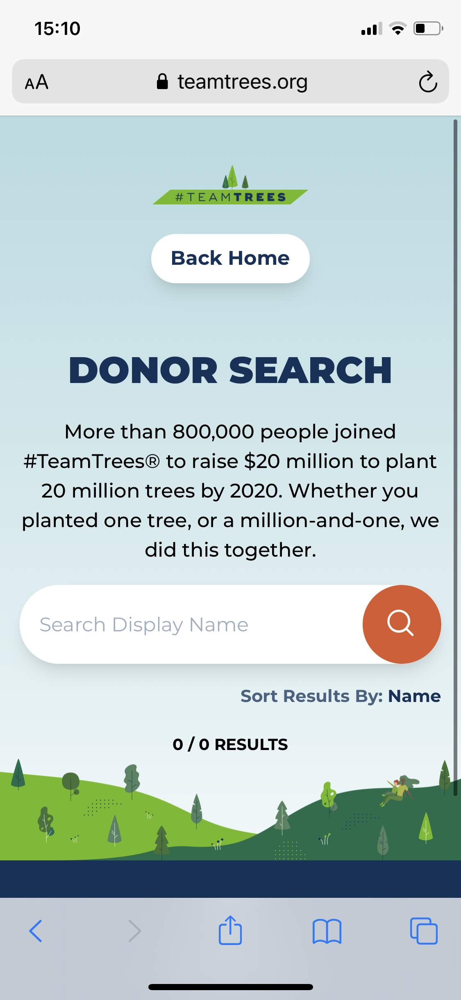

# Procesverslag
**Auteur:** Nino van der Vinden

## Bronnenlijst
1. -bron 1-
2. -bron 2-
3. -...-

## Eindgesprek (week 7/8)

-dit ging goed & dit was lastig-

**Screenshot(s):**

-screenshot(s) van je eindresultaat-

## Voortgang 3 (week 6)

-same as voortgang 1-

## Voortgang 2 (week 5)

-same as voortgang 1-

## Voortgang 1 (week 3)

### Stand van zaken

M'n code zag er netjes uit. Het enige was dat ik de pagina nog niet volledig gestyled had maar Jesse had er vertrouwen in dat dit sowieso goed zou komen gezien
mijn kwaliteiten. 

**Screenshot(s):**

Ik ben tot de sectie "Leaderboard" gekomen van de 1e pagina. Verder heb ik het hamburger menu fixed gemaakt met JS als er gescrollt wordt. Daarnaast heb ik ook
de radionbuttons + input field dynamisch gemaakt in selectie. 

-screenshot(s) van hoe ver je bent met korte uitleg-

### Agenda voor meeting

-samen met je groepje opstellen-

| student 1      | student 2          | student 3    | student 4        |
| ---            | ---                | ---          | ---              |
| dit bespreken  | en dit             | en ik dit    | en dan ik dat    |
| an dat ook nog | dit als er tijd is | nog een punt | dit wil ik zeker |
| ...            | ...                | ...          | ...              |

### Verslag van meeting

De meeting was tekstueel in teams. Vooraf heb ik aan iedereen gevraagd om kort op te schrijven wat ze wilde bespreken tijdens de voortgang.
Deze punten kwamen pas tijdens het voortgangsgesprek naar boven. Ik zelf had verder geen punten die ik wilde bespreken omdat alles verliep
hoe ik wilde dat het ging. 

## Breakdownschets (week 1)

-uitwerken voor de 1e werkgroep - eind van de eerste week-

## Intake (week 1)
-uitwerken voor de kick-off werkgroep - begin van de eerste week-

**Je startniveau:** zwart

**Je focus:** surface plane

**Je opdracht:** https://teamtrees.org/

**Screenshot(s) van de eerste pagina (small screen):**

**Screenshot(s) van de tweede pagina (small screen):**

