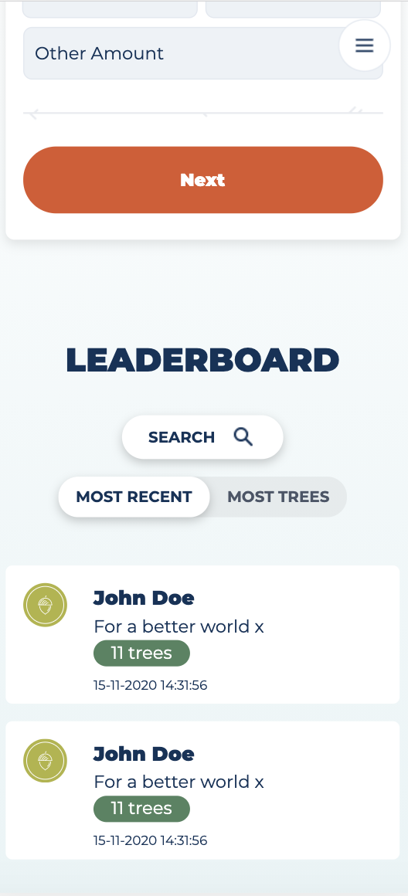

# Procesverslag
**Auteur:** Nino van der Vinden

## Bronnenlijst
1. https://stackoverflow.com/questions/9885551/how-to-reset-uncheck-radio-button-onclick-event/9885908
2. https://css-tricks.com/on-object-fit-and-object-position/
3. https://loopj.com/2008/06/16/removing-gaps-under-images-in-css/
4. https://css-tricks.com/almanac/selectors/n/not/
5. https://developer.mozilla.org/en-US/docs/Web/CSS/Using_CSS_custom_properties
6. https://stackoverflow.com/questions/16469548/overflowhidden-not-working-with-translation-in-positive-direction
7. https://stackoverflow.com/questions/24739126/scroll-to-a-specific-element-using-html
8. https://stackoverflow.com/questions/16371722/select-multiple-child-in-css
9. https://www.w3.org/WAI/PF/HTML/wiki/RoleAttribute
10. https://stackoverflow.com/questions/2795564/remove-styling-from-q-element
11. https://thenounproject.com/ - Selectief aantal icons voor #teamtrees store

## Eindgesprek (week 7/8)

-dit ging goed & dit was lastig-

**Screenshot(s):**

**1e pagina: Header**

Het hamburger menu is uitschuifbaar. Daarnaast is de video in de header clickable en uit zich in een pop-up.

**1e pagina: Hamburger menu **

Binnen het menu is de video ook clickable en uit zich in dezelfde pop-up. Verder zijn alle navigatie links
gekoppeld met de bijhorende sections en wordt hier dus naar gejumpt als er op een link geklikt wordt. 

**1e pagina: Video pop-up **

**1e pagina: Parallax onscroll **

Als er gescrollt wordt verdwijnt het grote getal achter de afbeelding.
Dit heb ik gerealiseerd met javascript en de scrollwaarde * 0.2 om het getal smooth te laten verdwijnen.

**1e pagina: Leaderboard **

**1e pagina: Map **

**1e pagina: Project **

**1e pagina: Socials **

Het stukje socials scheelde heel erg omdat de site van #teamtrees voorzien was van een iframe (slider) die ik kon implementeren in mijn eigen website. 

**2e pagina: Header **

**2e pagina: Producten **

**2e pagina: Over ons **

De 2e pagina is nog niet volledig af wegens tijdsgebrek door ziekte in de vakantie. 

## Voortgang 3 (week 6)

### Stand van zaken

Wegens ziekte was ik niet aanwezig bij de laatste voortgang.
Danny was hier van op de hoogte.
Daarnaast was ik volgens hem aardig opweg dus was feedback niet perse nodig. 

**Screenshot(s):**

-screenshot(s) van hoe ver je bent met korte uitleg-

### Verslag van meeting

n.v.t.

## Voortgang 2 (week 5)

### Stand van zaken

De feedback van Danny was dat ik nog even moest kijken naar bepaalde elementen: sections zonder heading kunnen beter een div zijn. 
Sommige div's kunnen buttons zijn, sommige divs kunnen ook een form element zijn. 

Daarnaast moest ik ook kijken of ik mijn classes kon reduceren met nth-of-type.

**Screenshot(s):**

Projects sectie gestyled.

Socials + footer gestyled.

### Verslag van meeting

Dankzij deze meeting ben ik gewezen op bepaalde dingen die ik over het hoofd had gezien m.b.t. mijn elementen. Het is altijd fijn om een 2e paar ogen naar je code te laten kijken.

## Voortgang 1 (week 3)

### Stand van zaken

Volgens Jesse was ik op de goede weg. Ik had nog niet 2 pagina's uitgewerkt, maar voor zo ver hij mijn code kon bekijken had hij er vertrouwen in dat het goed zou komen. Verder had ik op het moment ook nog geen vragen of liep ik tegen iets aan.

**Screenshot(s):**

De header van de website heb ik een background image gegeven (sterren) en een linear gradient.
Daarnaast heb ik de video samengesteld met allemaal losse images die een position absolute hebben.

Ik ben tot de sectie "Leaderboard" gekomen van de 1e pagina. Verder heb ik het hamburger menu fixed gemaakt met JS als er gescrollt wordt. Daarnaast heb ik ook de radionbuttons + input field dynamisch gemaakt in selectie.

### Agenda voor meeting

Lisanne: Ik wil bespreken hoe ik een foutmelding weg krijg in javascript. Terwijl het wel werkt.

Quincy:  Mijn navigatie flexbox (hoe ik deze gefixt/niet lelijk krijg).
	       Groottes van mijn content (en waarom sommige raar doen met het beeld).
	       geleidelijk vervagen van achtergrond.
	       Overlapping issues.
	       Border color > gradient (waar werkt dit niet bij mij?).
	       Vormen uit niets maken (of is het beter om een image te plakken?).
	       Slider voor mijn pagina (hoe zal ik dat aanpakken?).
	       Positionering zonder padding/margin misbruik (wat ik steeds heb gedaan).
         
Sam:     n.v.t.

### Verslag van meeting

De meeting was duidelijk en denk ik ook hulpvol voor mijn medestudenten. Op het moment zelf 
had ik nog geen vragen en alles verliep zoals het moest. Voorafgaande van de meeting had ik gevraagd
aan mijn medestudenten om voor zichzelf op te schrijven wat er besproken moest worden. Dit is
verder niet door iedereen in de groep gedeeld maar wel besproken tijdens de meeting.

## Breakdownschets (week 1)

## Intake (week 1)

**Je startniveau:** zwart

**Je focus:** surface plane

**Je opdracht:** https://teamtrees.org/

**Screenshot(s) van de eerste pagina (small screen):**

**Screenshot(s) van de tweede pagina (small screen):**

